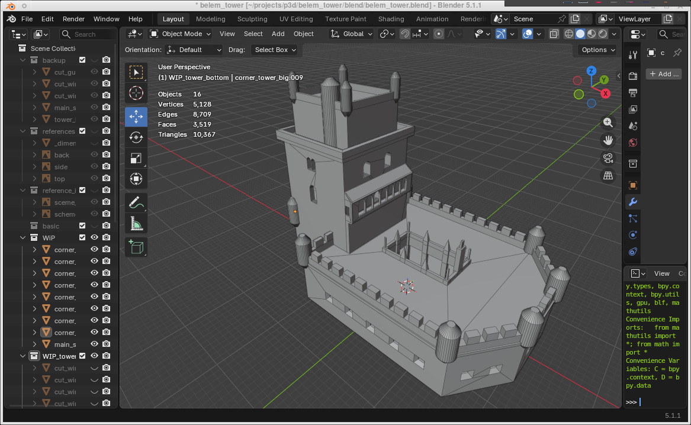

# Belém Tower / Torre de Belém

- full name: Torre de São Vicente a Par de Belém
- official: Torre de São Vicente

[Belem Tower](https://en.wikipedia.org/wiki/Bel%C3%A9m_Tower) model

## version 2

Implemented in Blender

### Dimentions

 - height:	 ~35 meters
 - width(tower): ~12 meters
 - width(all):   ~27.5 meters
 - length:       ~45 meters

### Current status

Update: 20260610

## version 1 (not finisher)

Removed. Store in git history. OpenSCAD

